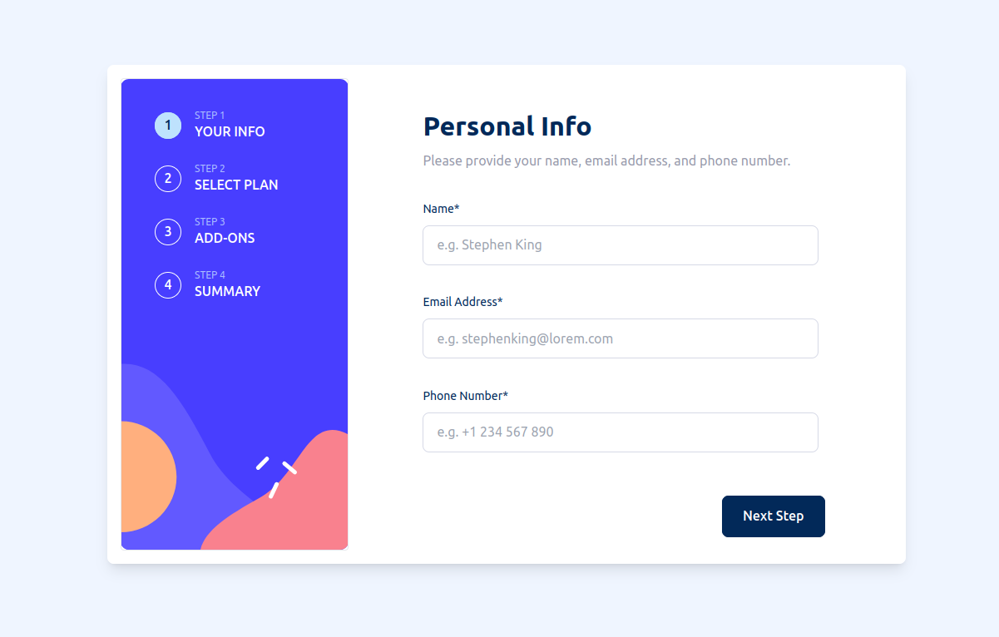

# Frontend Mentor - Multi-step form solution

This is a solution to the [Multi-step form challenge on Frontend Mentor](https://www.frontendmentor.io/challenges/multistep-form-YVAnSdqQBJ). Frontend Mentor challenges help you improve your coding skills by building realistic projects.
Live Website: [Multi-step form](https://angular-multi-step-form.netlify.app/)

## Table of contents

- [Overview](#overview)
  - [The challenge](#the-challenge)
  - [Screenshot](#screenshot)
  - [Links](#links)
- [My process](#my-process)
  - [Built with](#built-with)
  - [What I learned](#what-i-learned)
- [Author](#author)

## Overview

### The challenge

Users should be able to:

- Complete each step of the sequence
- Go back to a previous step to update their selections
- See a summary of their selections on the final step and confirm their order
- View the optimal layout for the interface depending on their device's screen size
- See hover and focus states for all interactive elements on the page
- Receive form validation messages if:
  - A field has been missed
  - The email address is not formatted correctly
  - A step is submitted, but no selection has been made

### Screenshot

### Built with
- Angular v. 18
- TailwindCSS
- Daisy UI
- Jest as testing framework

### What I learned
In this project I learnt how to use new Angular functionalities and how to structure a web-app that is a little more than a base app.

I also experimented with TailwindCSS and Daisy UI, which are two libraries that I never used before.
I tried to enhance code readability and maintainability by using Husky as a pre-commit hook and Jest as a testing framework.

## Author

- Website - [Luca Di Molfetta](https://www.linkedin.com/in/luca-di-molfetta/)
- Frontend Mentor - [@dimolf345](https://www.frontendmentor.io/profile/dimolf345)

